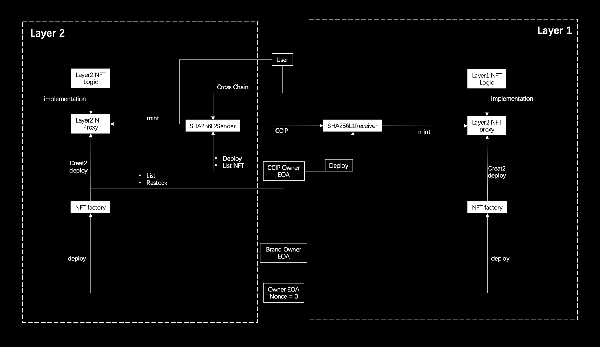

# SHA256 Smart Contracts

## /src/factory.sol
This factory contract allows fashion brands to generate their brand smart contracts. We utilize upgradeable contracts and create2 deployment, enabling brand smart contracts to maintain the same contract address across any EVM chain while having different logic.

## /src/template/layer2NFT.sol
This contract is the logic contract for NFTs on L2, which needs to be deployed on L2 in advance.

## /src/template/layer1NFT.sol
This contract is the logic contract for NFTs on L1, which needs to be deployed on L1 in advance.

## /src/SHA256L2Sender.sol
This contract is the CCIP message sender contract deployed on L2. Users interact with this contract to send messages to the SHA256L1Receiver, completing the L1 minting of NFTs.

## /src/SHA256L1Receiver.sol
This contract is the CCIP message receiver contract deployed on L1. Additionally, this contract is designated as the operator of brand smart contracts on L1.

## User Workflow
Users will first receive an NFT on L2 through clothing verification due to the sufficiently low transaction fees, allowing us to use a paymaster to provide users with zero-fee transactions.

Below is a diagram illustrating the deployment and interaction relationships of the contracts:
